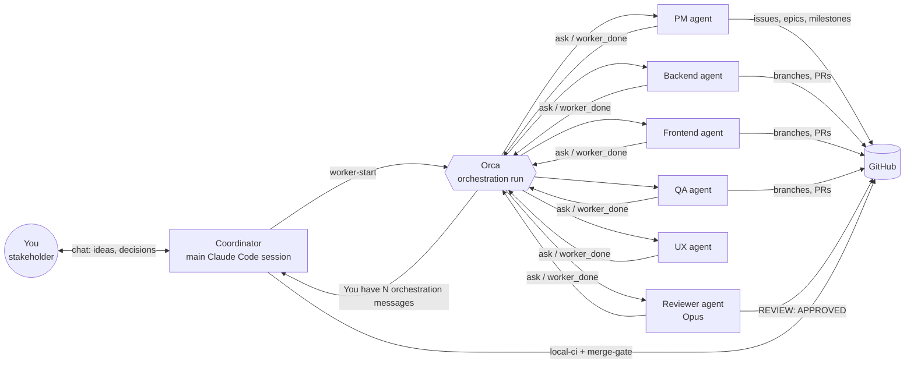
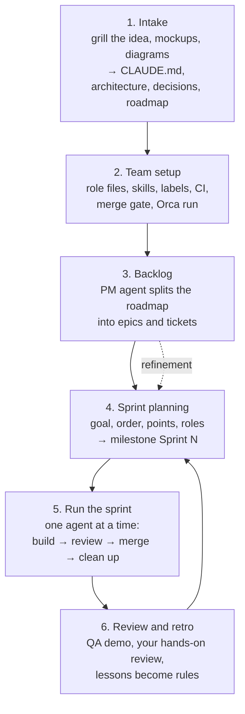
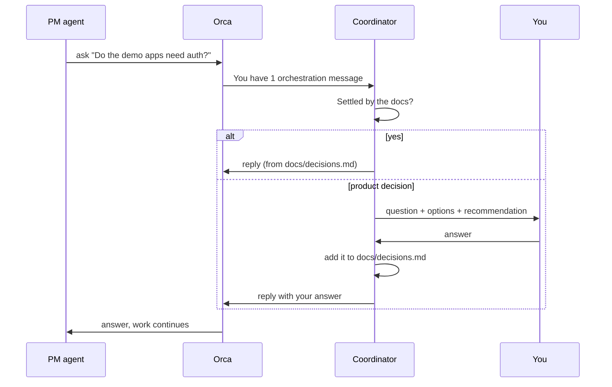
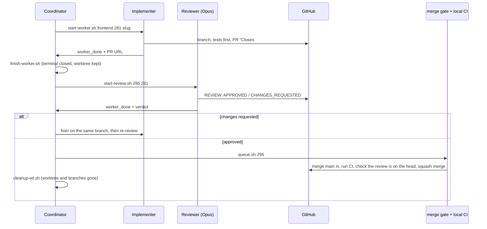

# agent-team

Build a whole project with an autonomous agent team, the Scrum way. You talk to one Claude Code session,
the **coordinator**. It turns your idea into docs, starts a Project Manager agent that writes the backlog,
then runs sprints of implementers, reviewers, QA and UX agents. Every agent is a separate **Orca** worker
with its own git worktree and terminal. Nothing reaches `main` without a review and a green merge gate.

```sh
npx skills add mberatsanli/ai --skill agent-team
```

Then tell your coordinator session something like *"build this project with an agent team"*.

## The big picture



- **You** only talk to the coordinator. Agents never ask you directly.
- **The coordinator** starts agents, answers their questions, asks you about product decisions only, and
  is the only one that merges.
- **Orca** runs each agent as a supervised worker: its own worktree, its own terminal, its own card in
  the sidebar. It carries messages between agents and the coordinator.
- **GitHub** holds the backlog (issues, labels, milestones) and the code (PRs).

## Phases



Each phase has its own file in [`phases/`](phases/). The coordinator finds where the project is and
picks up from there, so you can stop and come back in a new session.

## How a question reaches you

The PM (or any agent) hits something the docs don't settle. It blocks on `orca orchestration ask`:



Mid-work changes go the other way: `orca orchestration send --to dispatch:<id>` delivers a new
instruction to a running agent (for example "we run Scrum now: milestones, points, priorities").

## One issue, start to finish



The **merge gate** (`scripts/merge-gate` in your project) is the only way into `main`. It merges a PR
only when every required check passed on the head and the newest `REVIEW:` comment says `APPROVED` on
that head. An approval carries over a merge from `main` only when that merge touched none of the PR's
files. If GitHub Actions can't run, `scripts/local-ci` runs the same jobs on your machine and posts
commit statuses. Both scripts come with this skill; see [Merge gate and local CI](#merge-gate-and-local-ci).

## Roles

| Role | Model | Does | Skills it uses |
|---|---|---|---|
| Coordinator | your main session | process, questions, merges | `agent-team`, `orca-cli`, `grilling`, `triage` |
| Project Manager | Claude | backlog, epics, sprints, points | `to-spec`, `to-tickets`, `triage`, `domain-modeling` |
| Backend / Frontend | Claude | one issue, one PR | `tdd`, `implement`, `codebase-design`, `pr` |
| DevOps | Claude | tooling, CI, merge gate | `tdd`, `implement`, `pr` |
| QA | Claude | strict e2e tests, bug issues | `tdd`, browser tools |
| UX Designer | Claude | UX issues backed by how loved products do it | `research`, browser tools |
| Reviewer | Opus | verdicts on PRs, never its own | `codebase-design`, `improve-codebase-architecture` |
| Researcher | Codex or Claude | `docs/research/` notes | `research` |

Role files are in [`templates/agents/roles/`](templates/agents/roles/). Phase 2 copies them into your
project's `docs/agents/` and fills in your stack.

## Scripts

All in [`scripts/`](scripts/). They need `ORCA_RUN`; the rest has defaults (see `env.sh`).

| Script | Does |
|---|---|
| `start-worker.sh <role> <issue> <slug> ["extra"]` | starts one agent in a role on one issue, in a new worktree |
| `start-review.sh <pr> <issue> [round]` | starts the Opus reviewer; `b`, `c` for re-reviews |
| `wait-msg.sh` | blocks until a worker sends a real message, acks heartbeats on the way |
| `finish-worker.sh <dispatch> [rm]` | releases a worker, kills its leftovers, closes its terminals; `rm` removes the worktree |
| `cleanup-wt.sh <name>...` | removes finished worktrees and their branches |
| `queue.sh <pr>...` | merges PRs one by one through local CI and the merge gate, pulls `main` |
| `review-merge.sh <pr> <issue> <worktree> [round] [-- <next worker args>]` | review, merge on approval, clean up and start the next worker in one go; stops on a question or CHANGES_REQUESTED (`RESUME=1` continues after you answer) |
| `wait-load.sh [max]` | waits until the machine's load average is low enough |

Every agent spec carries [`scripts/rules.txt`](scripts/rules.txt), plus your project's
`docs/agents/agent-rules.md` if it exists.

## Built-in rules

- **Quiet machine:** one agent and one CI run at a time by default. No parallel test suites, no
  artificial CPU load.
- **Every job is an issue,** also the PM's backlog work, QA demos and UX research.
- **Red `main` stops the line:** a failing or flaky test becomes a priority-1 bug and goes first.
- **Tests stay strict:** no `skip`, no `test.fail()`, no bigger timeouts to sneak a PR in.
- **Clean up at once:** no idle agent, no stale worktree.
- **Human review freeze:** while you review the product by hand, no agent runs; every finding becomes
  an issue.
- **You decide scope;** irreversible or public actions are always asked first.

## Dependencies

### Tools

| Tool | Why | Get it |
|---|---|---|
| Orca (app + `orca` CLI) | runs every agent as a supervised worker, carries messages | the Orca app; check with `orca --version` |
| Claude Code | the coordinator and every agent | `npm i -g @anthropic-ai/claude-code` |
| `gh` (logged in) | issues, labels, milestones, PRs, reviews | `brew install gh && gh auth login` |
| `git`, Python 3.9+, a POSIX shell | the scripts, the merge gate and local CI | usually already there |
| Node.js (`npx`) | installs the skills below | `brew install node` |
| Docker (optional) | if your local CI or e2e runs containers | Docker Desktop or OrbStack |
| Codex CLI (optional) | the Researcher role | `npm i -g @openai/codex` |

### Skills

The coordinator needs the Orca skills, installed once for your user:

```sh
orca skills install --skill orca-cli --skill orchestration
```

Every agent needs the workflow skills from [mattpocock/skills](https://github.com/mattpocock/skills),
installed **in the project**, so every worktree has them (phase 2 does this):

```sh
npx skills add mattpocock/skills \
  --skill grilling --skill to-spec --skill to-tickets --skill triage \
  --skill tdd --skill implement --skill pr --skill research \
  --skill codebase-design --skill domain-modeling --skill improve-codebase-architecture
```

| Skill | From | Used by |
|---|---|---|
| `orca-cli`, `orchestration` | Orca (bundled) | coordinator |
| `grilling` | mattpocock/skills | coordinator (intake) |
| `to-spec`, `to-tickets`, `triage`, `domain-modeling` | mattpocock/skills | PM, coordinator |
| `tdd`, `implement`, `pr`, `codebase-design` | mattpocock/skills | implementers, DevOps, QA |
| `improve-codebase-architecture` | mattpocock/skills | Reviewer |
| `research` | mattpocock/skills | UX, Researcher |
| Claude in Chrome (browser tools) | Claude extension | QA, UX, Reviewer for UI |

## Merge gate and local CI

The skill ships both scripts in [`templates/scripts/`](templates/scripts/). They use only the Python
standard library, `gh` and `git`, so they work in a project in any language. Phase 2 installs them:

```sh
SKILL=~/.claude/skills/agent-team
mkdir -p scripts
for f in merge-gate local-ci agent_team_config.py; do cp "$SKILL/templates/scripts/$f" scripts/; done
cp "$SKILL/templates/agent-team.json" .
```

Then edit `agent-team.json` for your project. It is the only place for project-specific settings:

```json
{
  "requiredChecks": ["checks", "e2e", "pr-title"],
  "carryOverLockFiles": ["package-lock.json"],
  "mergeGate": { "localCiOnUpdate": false },
  "localCi": {
    "setup": "npm ci",
    "jobs": [
      { "name": "checks", "command": "scripts/ci/checks.sh" },
      { "name": "e2e", "command": "scripts/ci/e2e.sh", "needsDocker": true },
      { "name": "pr-title", "command": "scripts/ci/pr-title.sh \"$PR_TITLE\"" }
    ]
  }
}
```

- `requiredChecks`: your CI job names. The gate refuses while any of them failed, runs or never ran.
- `localCi.jobs`: the same jobs, run one after another by `scripts/local-ci <PR>`. Each job calls the
  same script your GitHub Actions job calls, so both prove the same thing.
- `localCiOnUpdate`: turn it on while GitHub Actions can't run (or use `AGENT_TEAM_LOCAL_CI=1`). Then
  `scripts/merge-gate <PR> --update` runs local CI itself.

Try it with `scripts/merge-gate <PR> --dry-run`. Every field, the exit codes and the carry-over rule:
[`templates/scripts/README.md`](templates/scripts/README.md). The repo owner and name come from
`gh repo view`, the base branch from the PR.

## Layout

```
agent-team/
├── SKILL.md               entry point: phases, roles, rules
├── phases/                1-intake … 6-review-retro, orca.md
├── templates/agents/      team, scrum, issue tracker, code standards, roles/
├── templates/scripts/     merge-gate and local-ci, copied into your project
├── templates/agent-team.json  their config, copied to your repo root
├── templates/scripts/ci/  checks, pr-title, dev-smoke job scripts
├── templates/github/      CI and PR title workflows
├── templates/docs/        sprint report and Daily Scrum issue
├── tests/                 tests for merge-gate and local-ci (python3 -B -m unittest)
└── scripts/               the coordinator's loop
```
